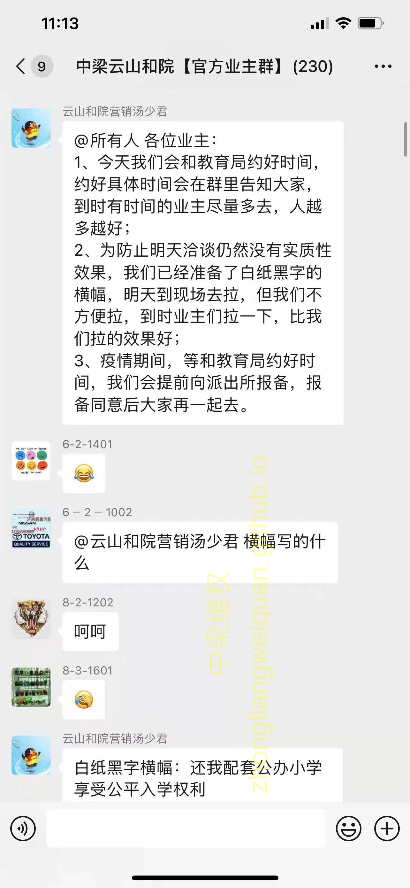

- 4月1日第二次天桥区教育局对接记录01

<video src="/4月1日第二次教育局对接记录/4月1日第二次教育局记录01.mp4" controls="controls" style="max-width: 100%; display: block; margin-left: auto; margin-right: auto;"  controlsList="nodownload">
your browser does not support the video tag
</video>

- 4月1日第二次天桥区教育局对接记录01

<video src="/4月1日第二次教育局对接记录/4月1日第二次教育局记录02.mp4" controls="controls" style="max-width: 100%; display: block; margin-left: auto; margin-right: auto;"  controlsList="nodownload">
your browser does not support the video tag
</video>

- 4月1日第二次天桥区教育局对接中梁工作人员冒充业主在教育局门口拉横幅

<video src="/4月1日第二次教育局对接记录/4月1日第二次教育局记录03中梁自己拉很横幅.mp4" controls="controls" style="max-width: 100%; display: block; margin-left: auto; margin-right: auto;"  controlsList="nodownload">
your browser does not support the video tag
</video>

中梁工作人员公告：

- 中梁工作人员提供4月1日中梁与教育局对话录音

<video src="/4月1日第二次教育局对接记录/4月1日中梁与教育局对话录音.m4a" controls="controls" style="max-width: 100%; display: block; margin-left: auto; margin-right: auto;"  controlsList="nodownload">
your browser does not support the video tag
</video>