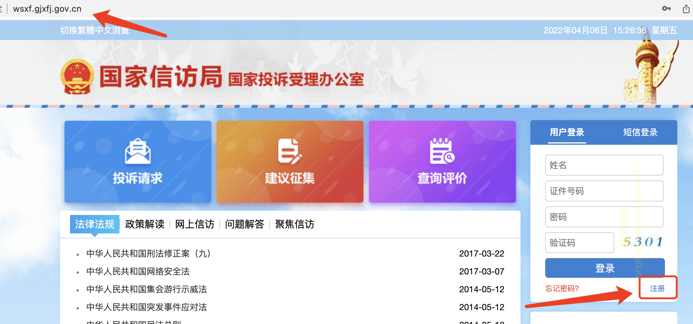
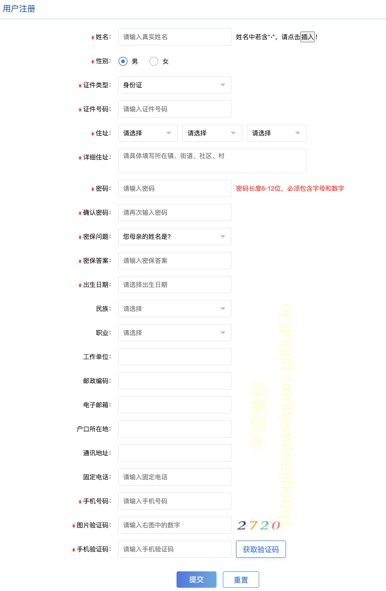
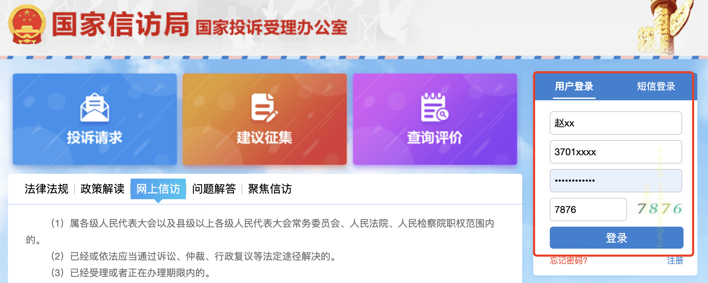
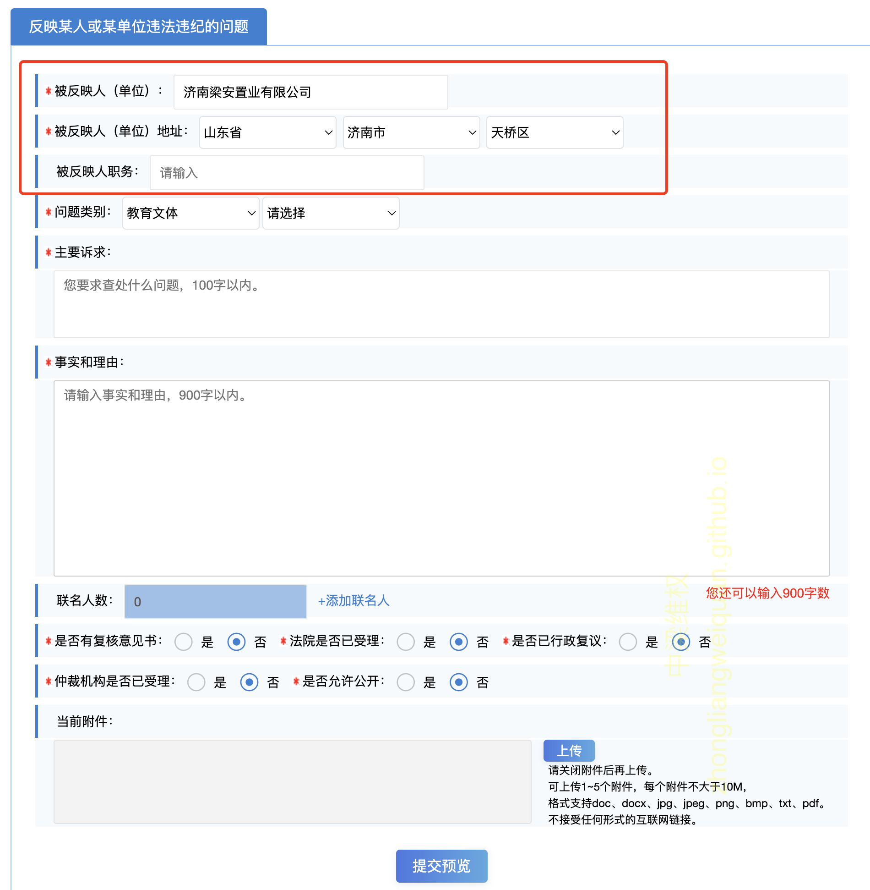

# 国家信访局（国家投诉受理办公室）网上信访规定

- 网上信访

    网上信访是公民、法人或者其他组织通过党委和政府信访网站或电子信箱等反映情况，提出建议、意见或者投诉请求，依法由有关国家机关处理的活动。

- 国家投诉受理办公室投诉须知

	依据《信访条例》有关规定，信访事项自受理之日起60日内办结，情况复杂的延期30日办结，请您在受理办理期限内不要重复网上信访。    

	依据《信访条例》和“诉访分离”的要求，对已经、正在或依法应当通过诉讼、仲裁、行政复议解决的事项，信访部门不予受理。

# 投诉请求内容示例
内容仅供参考，请依据实际情况修改.

> 我是中梁云山和院业主，买房时售楼处给我出示药山西小学代建协议，保证中梁孩子入学药山西小学。前一段时间了解到中梁没有代建小学，没有签约药山西小学的汇才学校，无法确保中梁的孩子顺利入学药山西X地块小学，中梁存在虚假宣传欺诈销售问题！
>
> 诉求：要求中梁云山和院履行承诺，签约药山西小学的汇才学校。

# 操作步骤

- 官网地址 http://wsxf.gjxfj.gov.cn/

- 用户实名注册

输入网址，右侧 登录按钮下，点击 【注册】

此时弹出注册须知弹框，勾选【我已阅读并同意】，点击【同意】按钮

跳转到用户注册页面，依次输入标星内容，手机号码验证，点击【提交】按钮

注册成功。

- 用户登录

注册成功后，回到首页，输入用户信息，登录

- 提交投诉请求

登陆后，在网站首页左侧，点击【投诉请求】

此时会弹出投诉须知，阅读并勾选同意，点击 【同意】

选择信访目的，可以选择【要求解决某事】或【反应某人或某单位违法违纪问题】，后面会分别给出示例。

如果选择【要求解决某事】，会跳转到编写投诉请求【要求解决某事】页面，如下示例

如果选择【反应某人或某单位违法违纪问题】，会跳转到编写投诉请求【反应某人或某单位违法违纪问题】页面，如下示例

编写完成后，点击【提交预览】，显示内容预览，点击【确定提交】即可。

