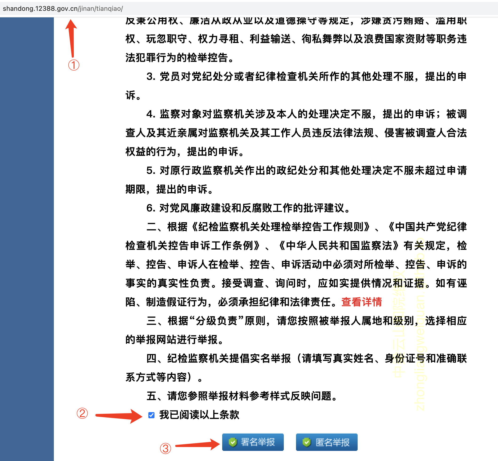

# 条例规定

## 纪检监察机关举报网站受理范围

> 2. 对监察对象（监察法规定的六类公职人员，下同）不依法履职，违反秉公用权、廉洁从政从业以及道德操守等规定，涉嫌贪污贿赂、滥用职权、玩忽职守、权力寻租、利益输送、徇私舞弊以及浪费国家资财等职务违法犯罪行为的检举控告。

## 《〈中华人民共和国监察法〉释义》

> 第十五条 监察机关对下列公职人员和有关人员进行监察：
> 
> （一）中国共产党机关、人民代表大会及其常务委员会机关、人民政府、监察委员会、人民法院、人民检察院、中国人民政治协商会议各级委员会机关、民主党派机关和工商业联合会机关的公务员，以及参照《中华人民共和国公务员法》管理的人员；
> 
> （二）法律、法规授权或者受国家机关依法委托管理公共事务的组织中从事公务的人员；
> 
> （三）国有企业管理人员；
> 
> （四）公办的教育、科研、文化、医疗卫生、体育等单位中从事管理的人员；
> 
> （五）基层群众性自治组织中从事管理的人员；
> 
> （六）其他依法履行公职的人员。

# 操作步骤

- 天桥区纪委监委地址 http://shandong.12388.gov.cn/jinan/tianqiao/
- 用户实名举报

1. 打开链接，直接拖动到最下，勾选【我已阅读以上条款】,点击【署名举报】

2. 如图所示，依次填写内容，提交即可

