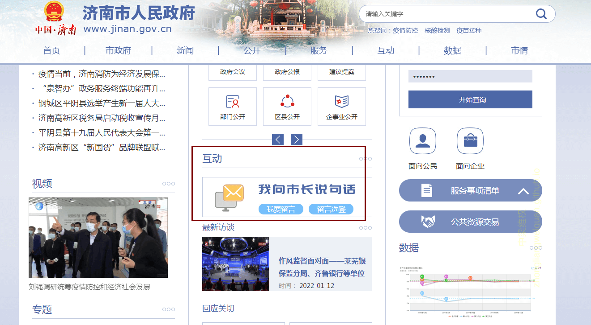
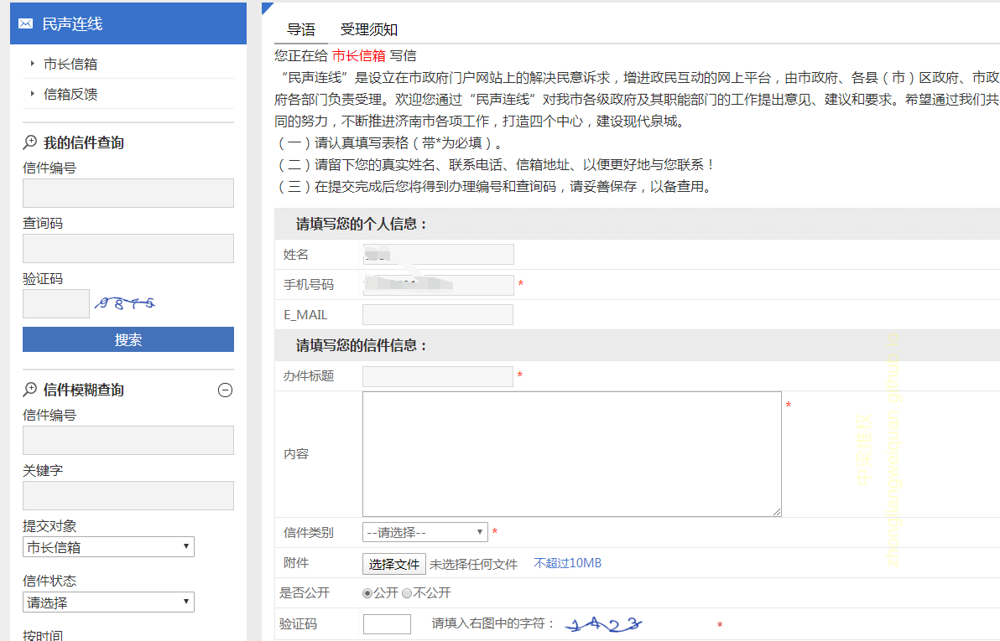
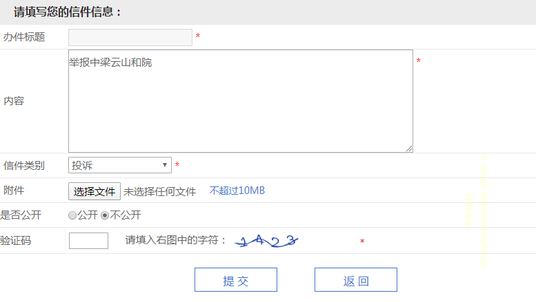

（编辑：业主小云）

# 投诉请求内容示例
内容仅供参考，请依据实际情况修改.

> 标题：举报无良开发商
>
> 内容：你好，我在 {修改内容： 20xx年xx月xx日购买了济南市天桥区中梁云山和院的xx号楼x单元xxx室 }。我在购房时，销售顾问介绍说药山西小学是中梁云山和院的配套小学。百分百可以入学。所以才买了中梁云山和院的房子。后来经查证，中梁云山和院并未代建学校，也未签约学校。所以并不是中梁云山和院的配套学校。我们全体业主要求中梁云山和院签约药山西小学所签约的汇才小学。中梁云山和院拒不执行。{修改内容： 我们两口子都是农村的，买房子首付款都是借的，现在每个月按揭，孩子面临入学，各项开支加起来入不敷出。如果没有学校我们买这个房子就没有意义了！现在我们两口子为房子天天吵架，对象还给闹离婚。} 请政府为我们做主。我们相信政府会为民请命。还我们公道！
>
> 信件类别：投诉

# 操作流程

市长信箱：(http://www.jinan.gov.cn/) 中间互动->我向市长说句话->我要留言

 
1、点击我要留言

未登录用户会跳转到登录页面，如果未注册，需要实名注册

 
2、无账号点击立即注册

3、输入个人信息-----下一步-验证身份-（填写个人信息）---点击注册

 
 

4、返回，使用账号密码登入，登入界面如下所示

 
5、最后点击提交

 

