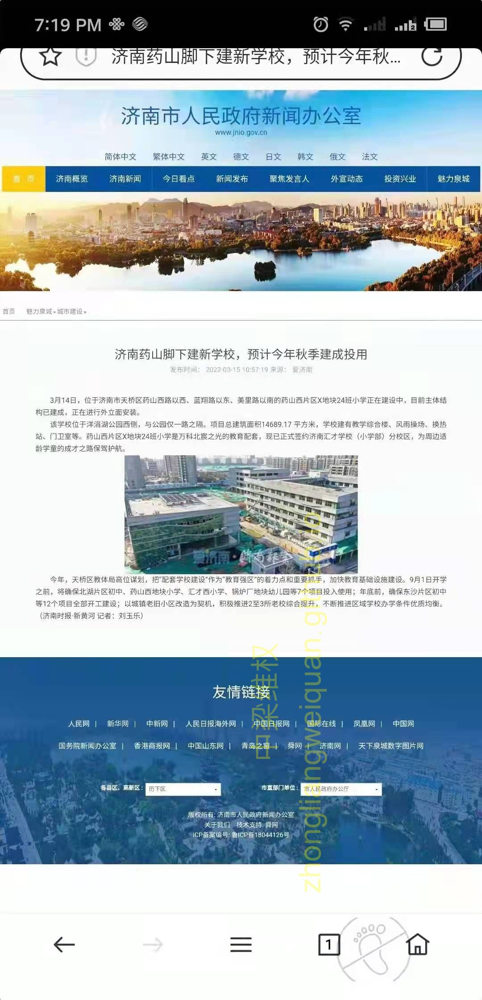

3月14日，位于济南市天桥区药山西路以西、蓝翔路以东、美里路以南的药山西片区X地块24班小学正在建设中，目前主体结构已建成，正在进行外立面安装。

　　该学校位于洋涓湖公园西侧，与公园仅一路之隔。项目总建筑面积14689.17 平方米，学校建有教学综合楼、风雨操场、换热站、门卫室等。药山西片区X地块24班小学是万科北宸之光的教育配套，现已正式签约济南汇才学校（小学部）分校区，为周边适龄学童的成才之路保驾护航。

　　今年，天桥区教体局高位谋划，把“配套学校建设”作为“教育强区”的着力点和重要抓手，加快教育基础设施建设。9月1日开学之前，将确保北湖片区初中、药山西地块小学、汇才西小学、锅炉厂地块幼儿园等7个项目投入使用；年底前，确保东沙片区初中等12个项目全部开工建设；以城镇老旧小区改造为契机，积极推进2至3所老校综合提升，不断推进区域学校办学条件优质均衡。（济南时报·新黄河 记者：刘玉乐）

济南市政府新闻办公室发布药山西小学： 